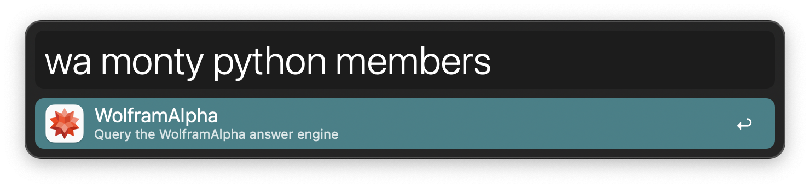
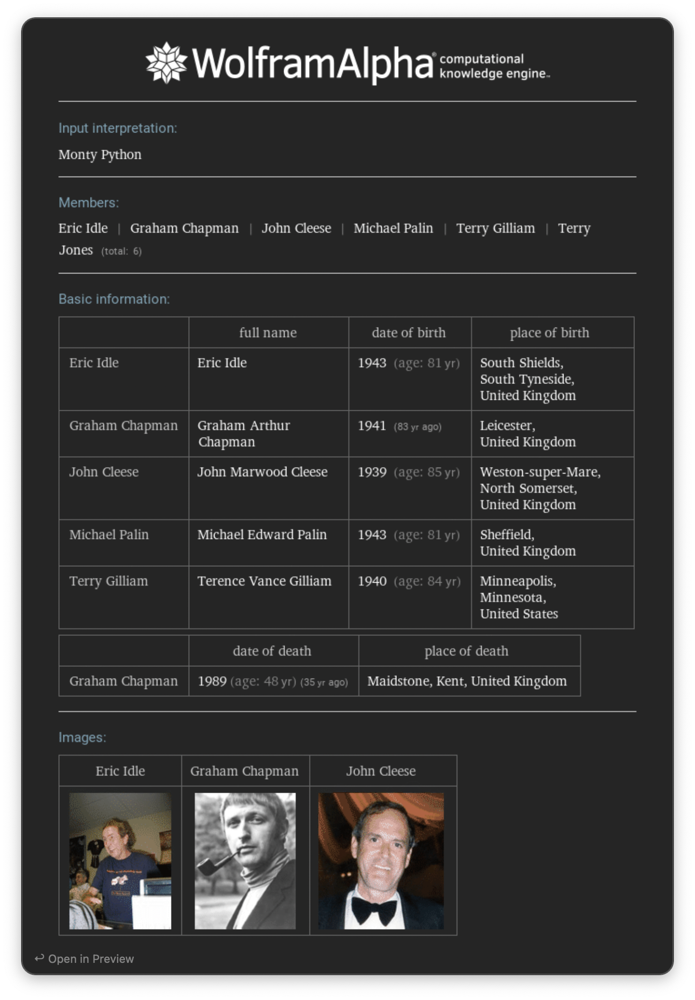

#  WolframAlpha Alfred Workflow

Query the WolframAlpha API

[⤓ Install on the Alfred Gallery](https://alfred.app/workflows/alfredapp/wolframalpha)

## Setup

1. Create a [Wolfram Alpha account](https://account.wolfram.com/login/create) and sign in to the [Developer Portal](https://developer.wolframalpha.com).
2. Click `Get an App ID`.
3. Use any `Name` and `Description` you see fit, pick the `Simple API`, and Submit.
4. Copy the `App ID` and add it to the [Workflow’s Configuration](https://www.alfredapp.com/help/workflows/user-configuration/).
5. Be patient, as it may take a few minutes for newly created API keys to begin working.

## Usage

Query [Wolfram|Alpha](https://www.wolframalpha.com) via the `wa` keyword.

* <kbd>↩&#xFE0E;</kbd> Open result image in Preview.
